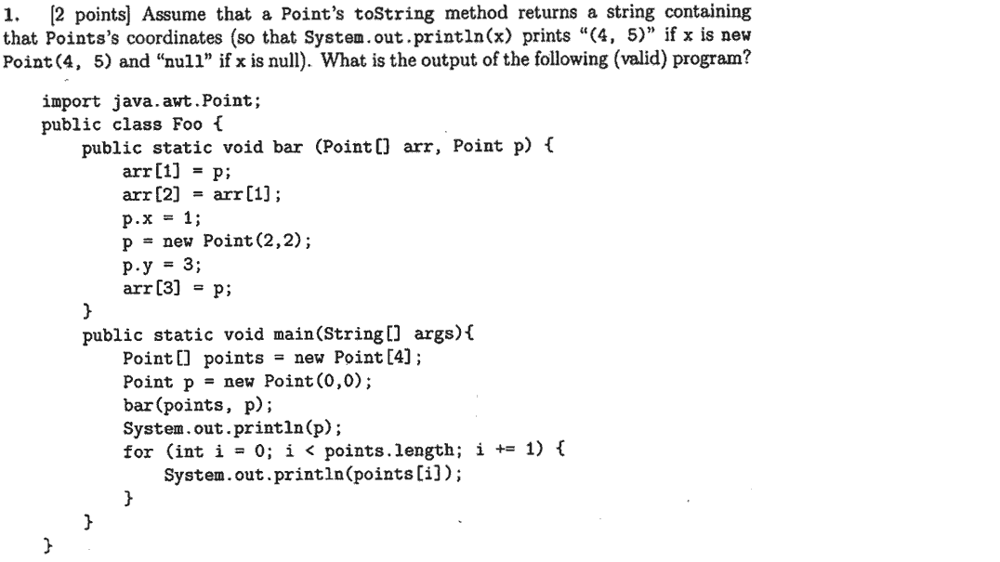

--- header

## 1. Bit Manipulation

--- code java BitManips.java
### 1a. Rotate a 32-bit integer left by `k` bits. Assume that `k` is less than 32.
--- yield
### 1b. Check if an integer is a multiple of 4 using only the `&` operator and equality checks. 
--- yield
### 1c. Check if an integer is odd <u>using only bit shifting and equality checks</u>.
Assume that you do not know the number of bits in your number.
--- yield
### 1d. Write a one-line expression equivalent to `x * 35` without using `*, /, or %`.
--- yield

### 1e. What does `n & (n - 1) == 0` test? (Fall 2013 Final Exam)
--- begin soln
This checks if `n` is a power of 2.

*Why? For anything but a power of 2 minus 1, the most significant bit will stay, and so the result will be nonzero.*
--- end soln


--- newpage

## 2. Lists

### 2a. `SList`s

Write a method that, given an `SList`, an `int` `j`, and an `int` `k`, return an `SList` with elements `k`, `k+j`, `k+2*j`, .... **Do not change the original list.**

--- code java Slist.java


--- newpage

### 2b. Arrays




--- newpage

## 3. Static and dynamic types review

```java
List l;
if (use_linked_list) {
    l = new LinkedList();
} else {
    l = new ArrayList();
}
```

**static types** = the **declared** type = checked at **compile time**  
We don't need to run the code to know that `l` is a `List`.

**dynamic type** = the **actual** type = checked at **run time**  
When we run the code, depending on the situation, `l` might either be a `LinkedList` or `ArrayList`.

```java
// What would Java do?
Collection c;
if (use_set) {
    c = new HashSet();
} else {
    c = new ArrayList();
}

// Example 1: works!
c.isEmpty();  // works because Collection.isEmpty() exists
c.size();     // works because Collection.size() exists

// Example 2: compile time error
c.sort();  // compile-time error: Collection.sort() doesn't exist
c.get(0);  // compile-time error: Collection.get(int) doesn't exist
```

Static types are like guarantees or agreements. The declaration `Collection c` means that `c` is guaranteed to have `Collection`'s methods, including `isEmpty()` and `size()`. Even though `ArrayList` has some additional methods like `sort()` and `get(int)`, there was no agreement that `c` would be an `ArrayList`, so you can't use these methods. Java does this to prevent you from calling methods that might not exist at runtime -- for example, what if `c` happens to be a `HashSet` and you called `c.sort()`?

Java follows simple rules (think: "Java is dumb"). Even when it's clear to you that `c` here is definitely an `ArrayList`, you still have to declare it as such. That is,

```java
Collection c = new ArrayList();
c.sort();
```

will still fail at compile time. This is not necessarily a bad thing! When I declare `c` to be a `Collection` here, it kind of means I'm saying "I just want a `Collection`, it'll be an `ArrayList` here but I don't want to do any `ArrayList`-specific things."

```java
// Example 3: works, but has different results
c.add(1);
c.add(1);
c.size();  // Will this equal 1 or 2?
```

Note that `Collection` has no method implementation of its own. Java knows to look at the methods for `HashSet` or `ArrayList`, depending on what the dynamic type of `c` is.


--- newpage

## 4. Static and dynamic types questions

### 4a. Spot the compile time errors. (There are four!)
--- code java CompileTimeErrorTest.java

### 4b. Where is the runtime error?
--- code java RuntimeErrorTest.java


--- newpage

## 5. Vroom Vroom!

To get the car rolling!

--- code java Vehicle.java

--- newpage soln

**What will happen after each of these snippets of code are compiled/run?**

### 5.1
```java
Vehicle v1 = new Vehicle(3,4,20,10);
System.out.println("Range of v1: " + v1.range());
```

--- soln Won't compile

### 5.2
```java
Vehicle v2 = new Car(20,20);
System.out.println("Range of v2: " + v2.range());
```

--- soln `400`

### 5.3
```java
Vehicle v3 = new Motorcycle(10,40);
System.out.println("Range of v3: " + v3.range());
```

--- soln `400`

### 5.4
```java
System.out.println("Number of seats of v2 " + v2.seats);
System.out.println("Number of seats of v3 " + v3.seats);
```

--- soln `4`, `1`

### 5.5
```java
System.out.println("Number of wheels of v2" + v2.wheels);
System.out.println("Number of wheels of v3" + v3.wheels);
```

--- soln `4`, `2`

### 5.6
```java
v2.putInTrunk("Backpack");
v2.putInTrunk("Laptop");
v2.putInTrunk("Shoes");
```

--- soln It will print out `There is no room in the Trunk` once because of the third item.

### 5.7
```java
v3.putInTrunk("Backpack");
v3.putInTrunk("Laptop");
v3.putInTrunk("Shoes");
```
--- soln It will print out `There is no room in the Trunk` three times because a `Motorcycle` has no trunk.
